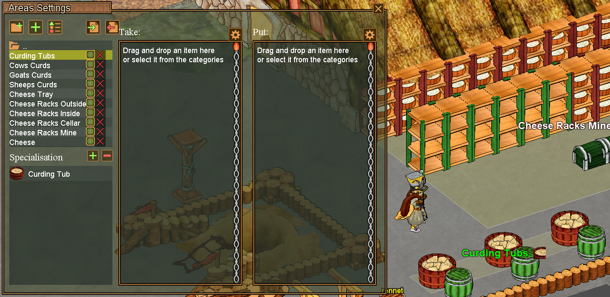
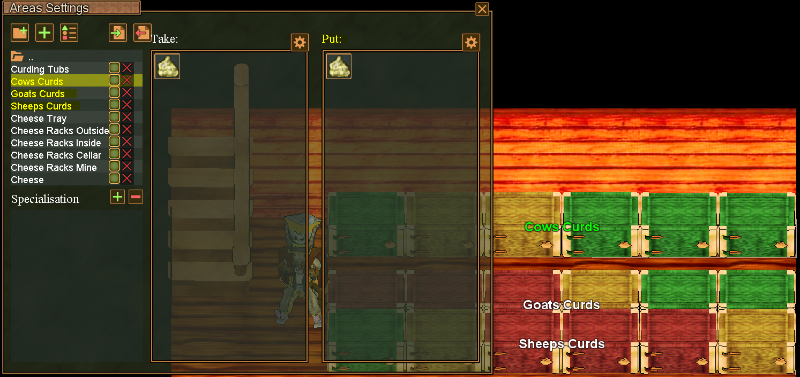

# Unload Curds Bot

This bot automatically collects curds from your curding tubs and organizes them by type into designated storage areas.

*Note:* this bot will **NOT** fill up curding tubs with milk/rennet. Perhaps sometime in the future.

## Overview

The Unload Curding Tubs bot checks your curding tubs for accumulated curds and automatically transfers them to appropriate storage containers. It handles all three curd types: cow, sheep, and goat curds.

## Required Areas Setup

You need to set up the following areas for the bot to function properly:

### 1. Curding Tubs Area

Create an area with the **Curding Tubs** specialization where your curding tubs are located.

- This area should contain all your curding tubs
- The bot will check these tubs for accumulated curds

### 2. Curd Storage Areas

Create separate "PUT" areas for each type of curd you want to collect:

- **Cow Curd Put Area**: Containers for storing cow curds
- **Sheep Curd Put Area**: Containers for storing sheep curds  
- **Goat Curd Put Area**: Containers for storing goat curds

Each put area should contain appropriate storage containers (cupboards, chests, etc.) where the bot will deposit the collected curds.

## How It Works

1. The bot scans your Curding Tubs area for tubs containing accumulated curds
2. When curds are found, the bot collects them from the tubs
3. Based on the curd type (cow/sheep/goat), the bot transports them to the corresponding put area
4. Curds are deposited into available containers in the appropriate storage area
5. The process repeats automatically until all curding tubs are empty

## Usage Tips

- Ensure your curding tubs area has enough space for the bot to navigate
- Keep sufficient empty container space in your curd put areas
- All three curd types can be processed in a single bot run

## Area Configuration

Make sure your areas are properly configured:
- Curding Tubs area: Set specialization to "Curding Tubs"
- Put areas: Configure as standard storage areas for each curd type
- Ensure proper navigation: either create routes connecting all areas, or position all areas within visual range of each other