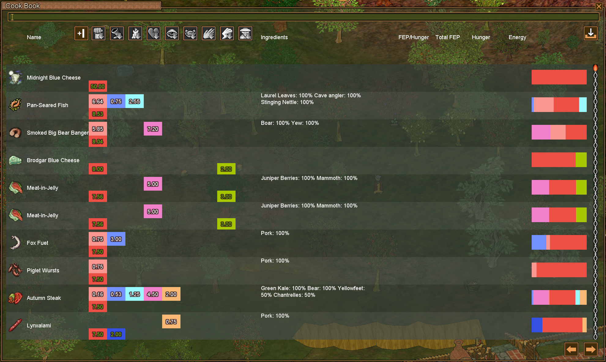

# Cookbook Usage

Cookbook allows you to import/save/view recipes you've previously cooked.

*Note:* Make sure to set up your database first. Read about it in **Setting Up SQLite Database** section.

## Importing Existing Recipes

If you have a recipes JSON file exported from the cookbook website you can import it into the database:

### From Cookbook UI

1. Open your Cookbook window
2. Click the **"Import"** button in the top toolbar
3. Select the JSON file with the recipes
4. Wait for the import to complete
5. Confirm the import was successful by looking through the cookbook.

## Managing Your Recipe Database

### Adding New Recipes

With database enabled, new recipes are automatically saved to the database when you:
- Create a new recipe in the cookbook
- Import recipes from game data

### Searching Recipes

- Search by recipe name with the search bar. Example query: `name:fishwrap`.
- You can also filter recipes by stat with the stat button shown in the image above.
- +I/+II buttons allow you to sort by the amount of stat you get. Also shown in the image above.
- At the bottom of the Cookbook page you have two buttons. Left array and right arrow that allow you to flip the pages if there are more results that can fit on one page.
