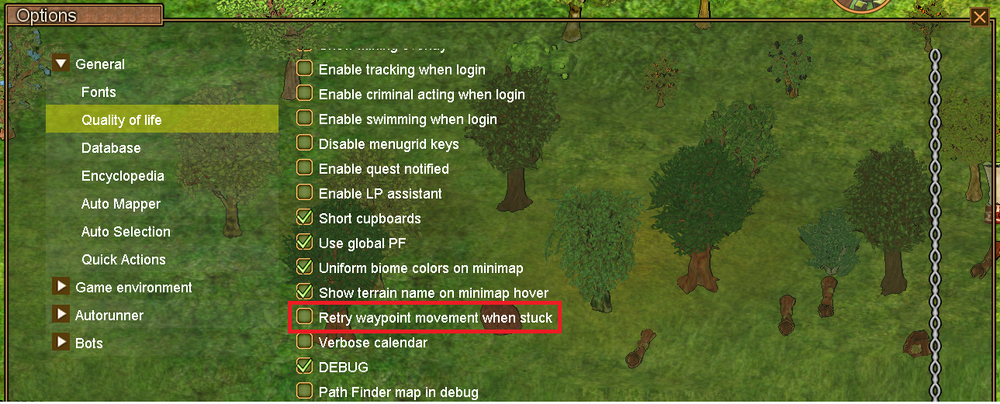

# Map Navigation Queue & Retry Settings

The **Map Navigation Queue** system allows you to queue multiple navigation destinations and configure retry behavior when navigation fails.

## Queue System

The queue system lets you add multiple destinations that will be processed sequentially:

### How to Use

1. Alt+left-click on the map to queue waypoints for travel.
2. Your character will navigate to queued destinations in order
3. The map displays all pending destinations
4. To clear the path right-click anywhere on the map.
5. If retry setting is on the character will retry going to the next node every 1 second if stuck.
6. If retry setting is off the waypoint queue will be cleared if stuck.

## Retry Settings

When navigation fails (blocked path, obstacle, etc.), the retry system determines whether to attempt again:

Retry settings can be accessed through the QoL settings panel:

