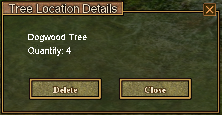
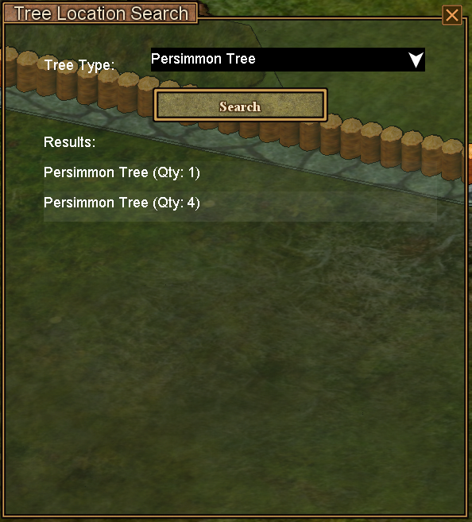

# Tree Locations Save System

The **Tree Locations Save** system allows you to save the locations of trees.

## Overview

This feature maintains a file of tree locations by type, making it easy to find specific trees you've saved.

## How It Works

The system records tree locations:

1. Right-click a tree, a new option appears (Save Tree Location/Save Bush Location)
2. All similar trees are detected around this tree.
3. Locations and quantities are saved to a persistent database
4. Access saved locations through the tree locations menu
5. View saved tree locations by pressing one of the lines in the Trees Search menu.

## Saving a Tree Location

Right-click a tree to bring up the flower menu to save the tree location:

## Accessing Tree Info from the Map

Right-click a tree icon on the map to get detailed info about the saved location. This panel also allows you to delete a saved tree.

## Accessing Tree Locations

Open the Tree Search menu from the main map. You'll see the following panel:

### Features

- **Tree Type Filter:** Select specific tree species to view
- **Location List:** All saved locations for selected tree type. Click any of the items in the list to show it on the map.

## Storage Location

Tree location data is saved to:

%APPDATA%/Haven and Hearth/tree_locations.nurgling.json

This file persists across game sessions and can be backed up.
