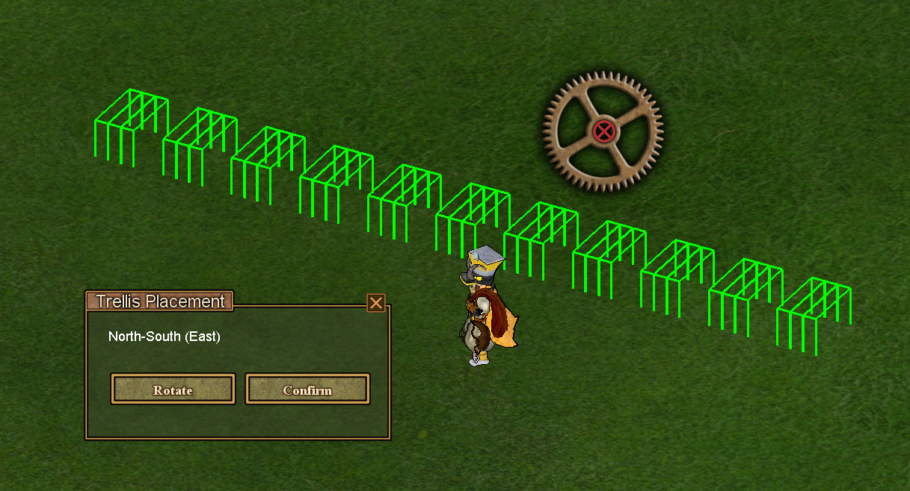
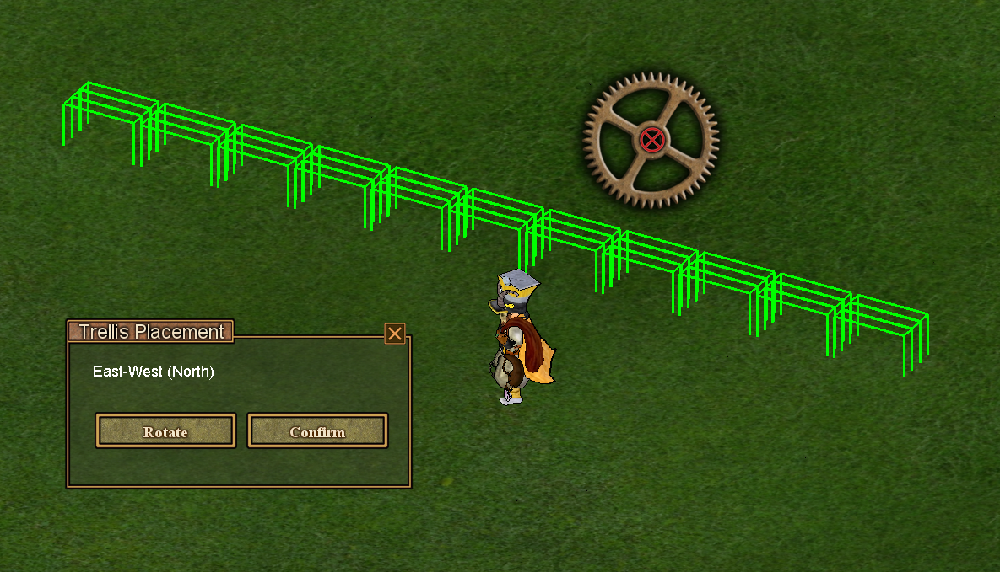

# @enc.trellis.title

@enc.trellis.intro

### @enc.common.settings

- @enc.trellis.setting_area
- @enc.trellis.setting_rotation

## @enc.trellis.howto_title

1. @enc.trellis.step1
2. @enc.trellis.step2
3. @enc.trellis.step3
4. @enc.trellis.step4
5. @enc.trellis.step5

