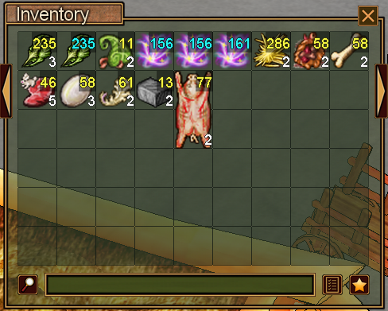
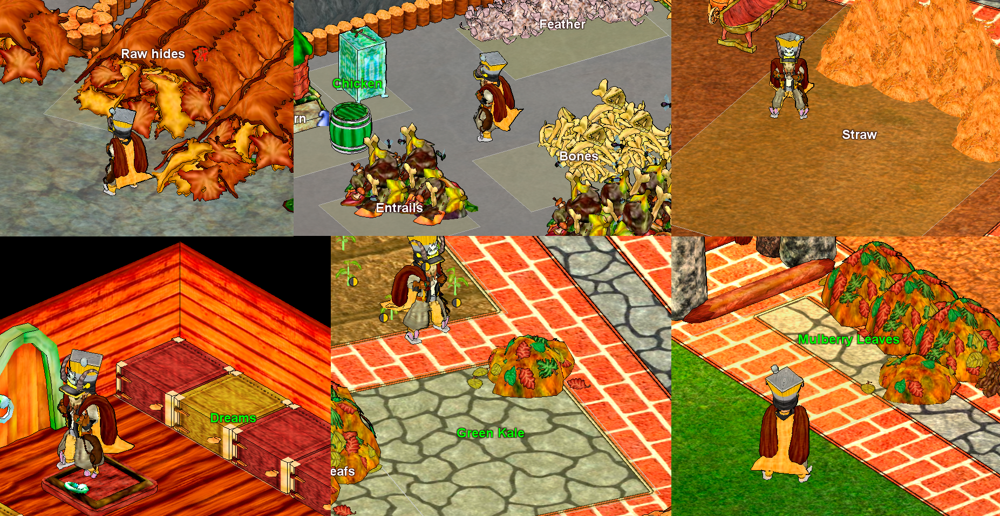
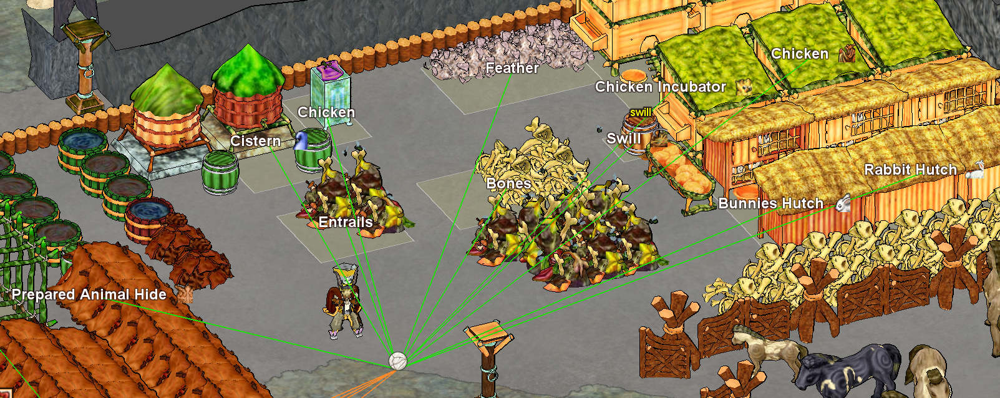
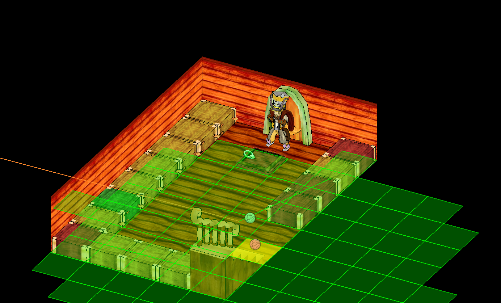

# Routes System

The **Routes System** allows you to create paths between different locations, enabling automated navigation for bots and manual travel convenience.

## Accessing the Routes Interface

To open the Routes interface, locate the button resembling a wheel or helm:

Clicking this button opens the main Routes UI. Your screen may appear largely empty initially:

## Managing Routes

Below is an overview of the main elements in the Routes UI.

### Routes List

The **Routes List** displays all saved routes. From this panel you can:

- View existing routes
- Select routes for editing
- Delete routes you no longer need
- Create new routes
- Rename existing routes

### Route Info

Each route is composed of **multiple points** that define its path. The **Route Info** panel allows you to:
- View special route points, such as doors, ladders, and mine holes
- Navigate directly to any route point by clicking it, provided a connection exists from your current location

*Note:* This panel is primarily for testing and advanced adjustments. Most users will rarely need to interact with it.

### Route Actions

The **Route Actions** panel is where you manage route creation and recording:

- **Red dot:** Start or stop route recording
- **Green plus:** Add a route point at your current location. *Note:* it's very important to only use this functionality either in the middle of recording, at the end or start of the route. **Important:** Only place points at the start, end, or midpoint of a route during recording. Randomly adding points far from the last will break the route.
- **Green fire:** Add a **hearthfire route point**. Hearthfire route points are special points that do not appear in a route. To define a hearthfire route point go to your hearthfire and click the button. Your character will navigate to the hearthfire and set a route point.
- **Use Hearth Fires in Global PF:** When enabled, the system calculates whether traveling via a hearthfire is faster than walking the route. If so, it will use the hearthfire.

*Tip:* Beginners are advised to avoid hearthfires initially. Master standard route creation before using hearthfire points.

## Creating Your First Route

1. Click the **green plus** at the top right of the Routes UI. A new route will appear (e.g., Route 0).
2. Right-click the route to rename it if desired.
3. Think of two areas in your village you would like to be connected. A good example could be going from `Outside` to `L3` or from `Outside` to the second floor of your `Stonestead` where your bed is.
4. Click the **red dot** to begin recording.
5. Travel to your destination. Your character will pause periodically to calculate route points—input is temporarily disabled until a **white dot** appears under your character. Continue walking normally, passing through doors, ladders, or mineholes as needed; the system automatically handles these.
6. Press the **red dot** again to stop recording once you reach your destination.

Your first route is now complete. Test it by clicking a route point in the **Route Info** panel—the character should navigate to the selected point.

As more routes are recorded, nearby points from different routes will automatically connect, creating a **network** that allows bots to find new paths across your village.

## Example Usage

Suppose your inventory is full after looting:

And you have designated areas for each item in the PUT section of the zone setup:

For this scenario to work we have to make sure all areas are reachable via a route or multiple routes. Here is a good example of a route point that is connected to a few areas. 

*Note:* Connections between route points and areas are established automatically during route recording.
*Note:* **Green lines:** connection between a route point and an area. **Orange lines** Connection between individual route points.

Once configured, use the `Free Inventory` bot to deposit items into their designated areas using the routes you created.

## Tips

1. If a route point is misplaced during recording, you can adjust it: select the route, click and hold the point, and move it within a 5x5 radius for fine-tuning.

