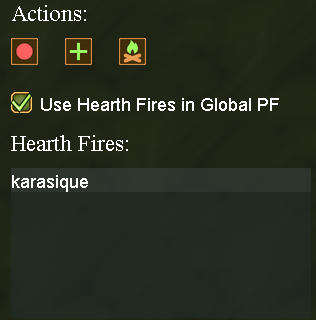

# Routes System

The Routes system allows you to create paths between different locations, enabling automated navigation for bots and manual travel convenience.

## Accessing the Routes Interface

To open up the routes UI find a button that looks like the wheel or the helm:

 
Once you click this button you should see the screen shown below, however your UI will likely be pretty empty in comparison.

## Managing Routes

We'll first cover all the elements of the UI.

### Routes List

The routes list shows all your saved routes. From here you can:
- View existing routes
- Select routes for editing
- Delete unwanted routes
- Create new routes
- Rename existing routes

### Route Info

Each route consists of multiple points that define the path. Route Info portion of the UI allow you to:
- See any special route points. For example: doors, ladders and mine holes.
- Navigate to any route point by clicking it, given there is a connection from your location to that point.

*Note:* do not worry about this piece, you will most likely never use it except for when you need to test things out.

### Route Actions

This section of the UI is how you interact with your routes:
- Red dot button allows you to start/stop recording of a route
- Green plus button allows you to place a route point at your current position in the current route. *Note:* it's very important to only use this functionality either in the middle of recording, at the end or start of the route. **Never** try to randomly add a point far from your last placed route point. This will break the route.
- Green fire button allows you to add a hearthfire route point. Hearthfire route points are special points that do not appear in a route. To define a hearthfire route point go to your hearthfire and click the button. Your character will navigate to the hearthfire and set a route point.
- If you check the `Use Hearth Fires in Global PF` and set the hearthfire route point during navigation the client will calculate weather traveling to your hearthfire is faster than walking the route to get to the destination. If it is it will travel to hearthfire.
*Note:* if you are only starting out with using routes we highly recommend avoiding hearth fires. Get used to using routes without it first.

## Creating Your First Route

1. At the top right of the Routes UI click the green plus button. This will add a new route called something like `Route 0`.
2. You can right-click the route and rename it if you'd like
3. Think of two areas in your village you would like to be connected. A good example could be going from `Outside` to `L3` or from `Outside` to the second floor of your `Stonestead` where your bed is.
4. Once you are ready to record your route click the red dot button. This will start the route recording process.
5. Start running to your destination. You will notice that every time you cover a small distance your character stops and gets anchored to a point. This is expected, a lot of calculations have to happen based on your position, which takes a bit of time. Input is disabled during this process until you see a white dot appear under your character. Once the dot appears continue walking. Feel free to walk through doors/mineholes/ladders - the routes system knows how to handle these.
6. Once you've arrived at your destination press the red dot button again. This will stop the recording process.

Now you've created your first route. You can try testing it by clicking one of the route points in the `Route Info` list at the bottom of the Routes UI. Your character should navigate to the point you've clicked.

As you create more routes they will connect to each other if two points from two different routes are located close to each other. This will form a web around your village, which will allow some of the bots to create new paths to navigate around your village.

## Advanced Route Features

[Coming soon...]

## Using Routes with Bots

[Coming soon...]

## Troubleshooting

[Coming soon...]