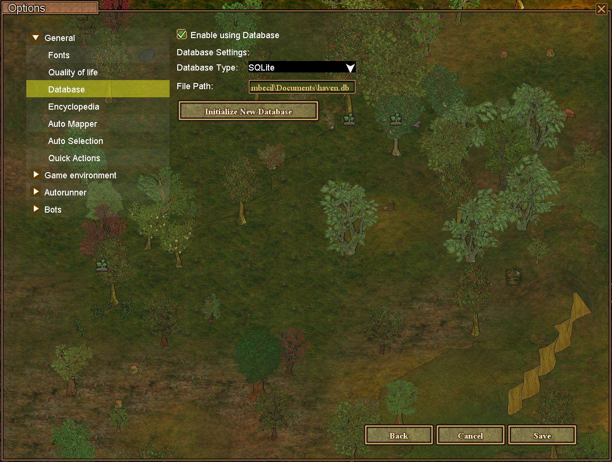
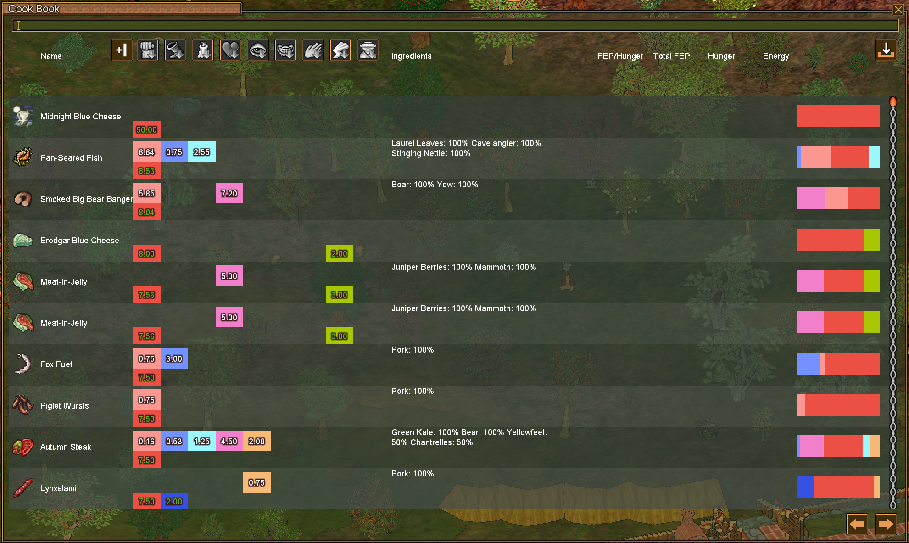

# Setting Up SQLite Database for Cookbook

This guide shows you how to enable SQLite database storage for your cookbook recipes. Recipes that you make or import are stored in the cookbook and will only persist through restarts if a database is setup. SQLite is the easiest option to setup.

## Why Use SQLite Database?

- Recipes are saved permanently and won't be lost when you restart the client
- Faster searching and filtering of recipes
- Better performance with large recipe collections
- Easy backup and restore of your recipe collection

## Enabling SQLite Database

### Enable Database in Settings

1. Open the Nurgling2 settings window
2. Navigate to the **General** -> **Database** section
3. Check the box for **"Enable using Database"**
4. Select **"SQLight"** in the **"Database Type"**
5. Click **"Initialize New Database"** button
6. Click **"Save"**

## Importing Existing Recipes

If you have a recipes JSON file exported from the cookbook website you can import it into the database:

### From Cookbook UI

1. Open your Cookbook window
2. Click the **"Import"** button in the top toolbar
3. Select the JSON file with the recipes
4. Wait for the import to complete
5. Confirm the import was successful by looking through the cookbook.

## Managing Your Recipe Database

### Adding New Recipes

With database enabled, new recipes are automatically saved to the database when you:
- Create a new recipe in the cookbook
- Import recipes from game data

### Searching Recipes

The database enables enhanced search features:
- Search by recipe name
- Search by ingredients
- Filter by category
- Sort by creation date or name

