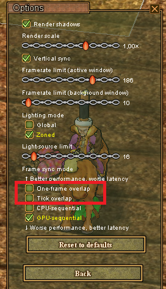
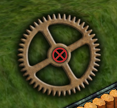
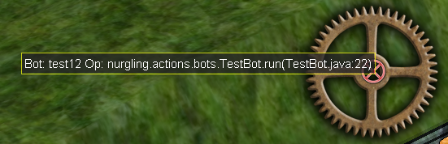

# Welcome to the Encyclopedia

This is the Nurgling2 client encyclopedia system. It outlines basic functionality of the client. If you have any questions this is the best place to start.

## If you have performance issues while the bots are running:

Bots work within the frame system, so the overlap technology is not consistent with the bot runtime engine. Do not use the first 2 points.

## My bot X is broken:

If you have a broken bot but have already completed step 1. fulfil the following set of conditions:
- Clear your inventory
- Get off the horse
- Switch off the stacks

## How do I stop a running bot:

Click on the cross in the center of the gear

## How to report an error:

In the middle of the gear, information about the current bot execution string is displayed. If you have a hang - send a screenshot to the appropriate section

